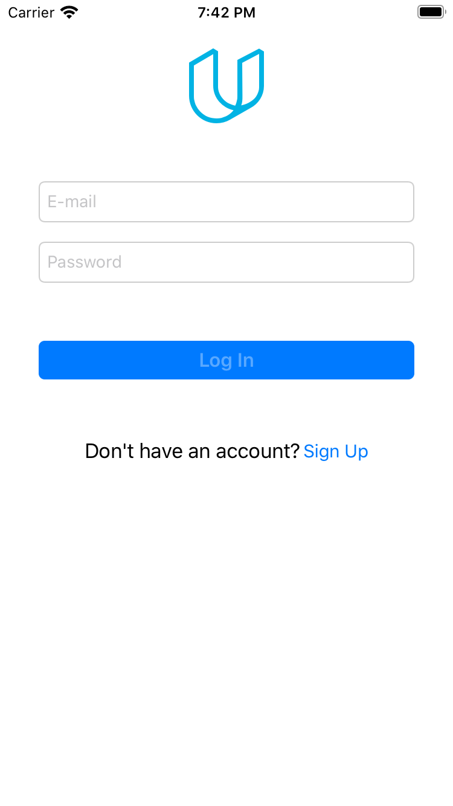
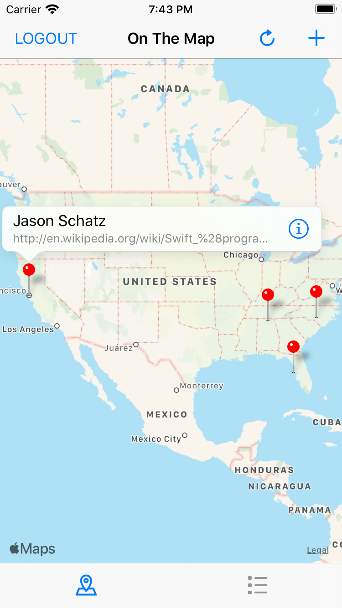
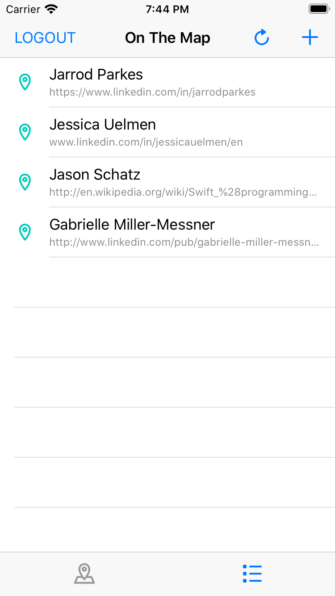
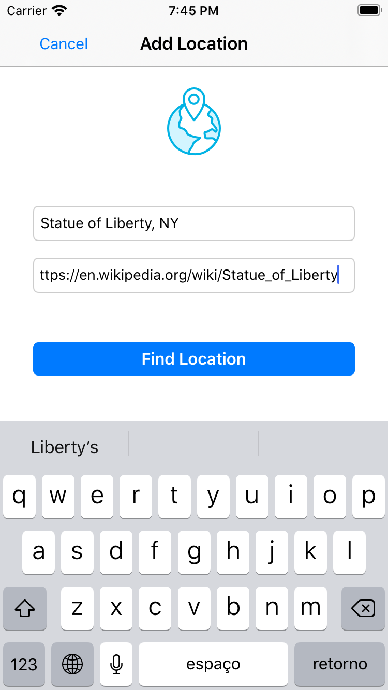
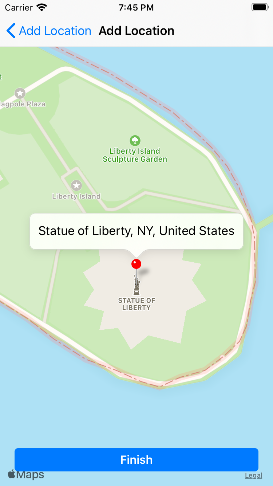
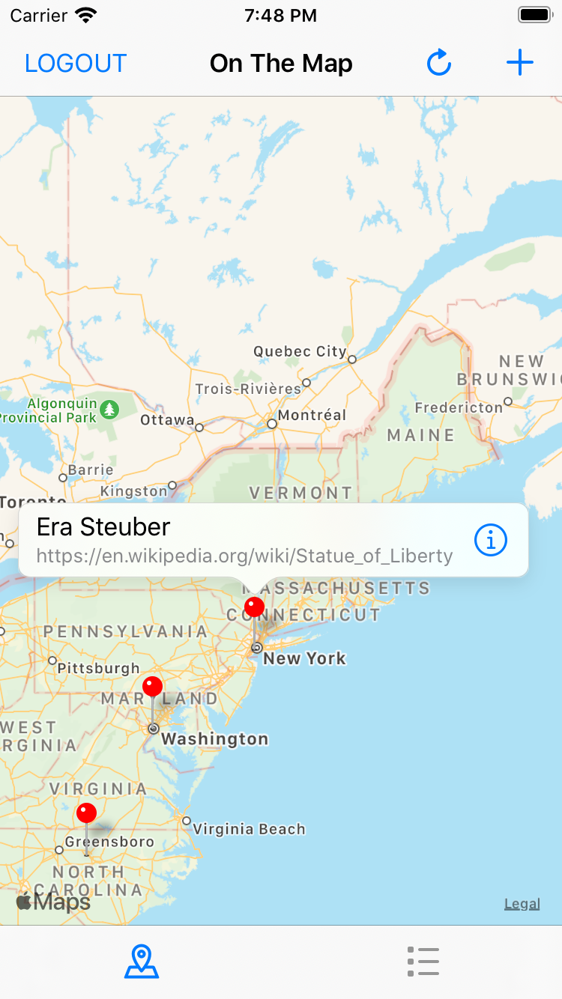
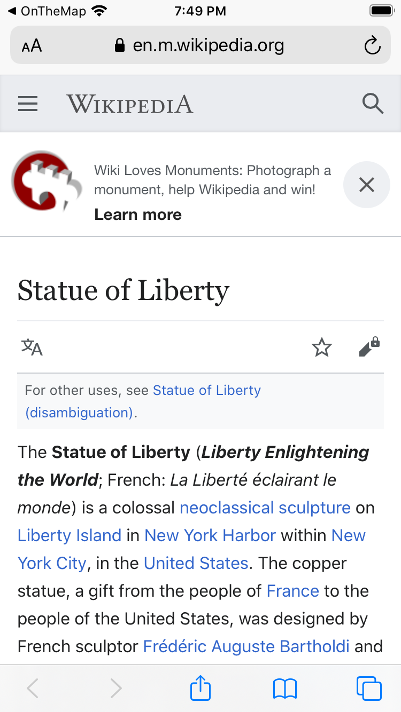

# On The Map

Fourth project of [Udacity's iOS Developer Nanodegree](https://www.udacity.com/course/ios-developer-nanodegree--nd003). 

This project consists of working with networking where some geolocation data should be fetched from Udacity API's and parsed to be displayed in the app in 2 different views:
- a map, with corresponding pins for each location fetched
- a list, with the most recent locations fetched

By clicking in the pin's ballon or in a list item, app will open the corresponding URL provided alongside the location in Safari

App will also allow users to search locations by address and add it as a new location in the API, so it will be shared with other users that consumes the API.

Finally, the app will require user authentication using Udacity credentials, so it is necessary to have an Udacity account (app provides a button on the main screen that leads to the Udacity sign-up page).

It's a simple app that plays around with `AVFoundation` where users can record their voices and play with different effects (echo, pitch distortion, reverb, etc.)

**Technical Approach**
- App can work with real API data and fake data. Fake data consists of a mock gateway that will always generate static data, so it helps to test the app without internet connection and accelerated the app development.
- `MapKit` was used to display maps and pins.
- `CLGeocoder().geocodeAddressString()` was used to search addresses and get corresponding placemarks.
- `URLSessionDataTask` was used for HTTP requests
- `JSONDecoder` and `JSONSerialization` was used for JSON parsing

**Screenshots**

<table align="center">
  <tr>
     <td>
       
       
Main screen with login fields and sign up button

     </td>
     <td>
       
       
Sign Up Page

     </td>
  </tr>
  <tr>
     <td>
       
       
Main map screen

     </td>
     <td>
       
       
Main locations list

     </td>
  </tr>
  <tr>
     <td>
       
       
Add location screen

     </td>
     <td>
       
       
Add location confirmation

     </td>
  </tr>
  <tr>
     <td>
       
       
Map with new location added

     </td>
     <td>
       
       
Location URL opened

     </td>
  </tr>
</table>

## Installation

Clone this repository, import into [Xcode](https://developer.apple.com/xcode/) and build it with simulator.

By default, app uses the real gateway, but if you launch the app with `--mockAPI` command line argument the mock gateway will be used instead.

**Note:**  You can select the corresponding scheme in Xcode (`OnTheMap (MockAPI)`) as a shortcut to launch the app with mock API.

## Copyright

Project developed by Márcio Souza de Oliveira.
